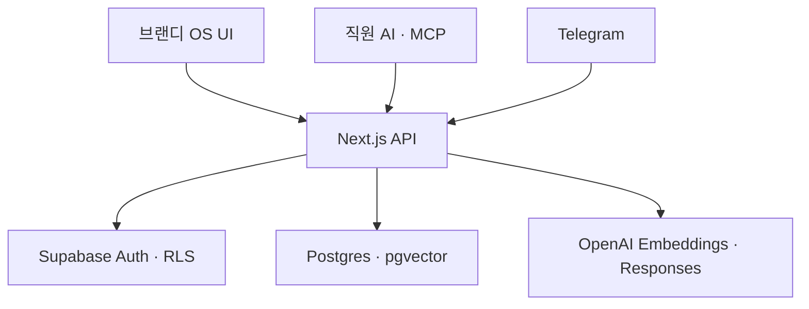

# 브랜디 OS v2 구현·인수 문서

## 1. 이번 구현 범위

업로드된 핸드오프 문서와 UI 밑그림의 3단 정보 구조(대분류 → 메뉴 → 본문)를 Next.js로 다시 구현했다. 첫 운영 축은 지식의 생성, 검색, 검토, 정본화다.

| 영역 | 구현 상태 | 실제 동작 |
| --- | --- | --- |
| 로그인 | 구현 | Supabase Auth 세션 생성·복구·로그아웃 |
| 홈 | 구현 | 지식/검토/연결 상태 요약 |
| 문서 작업공간 | 구현 | 목록, 필터, 신규 작성, 편집, 낙관적 버전 충돌 방지 |
| 검토함 | 구현 | `draft → team → review → reviewed → canonical` 상태 전환 |
| 지식 검색 | 구현 | 키워드/의미/하이브리드 검색, 문서·버전·청크 인용 |
| 직원 AI API | 구현 | 사용자 JWT 및 읽기 전용 Agent PAT 인증 |
| Telegram 창구 | 구현 | 웹훅 검증, 사용자 제한, 정본 검색, 근거 기반 답변 |
| MCP | 구현 | 검색, 원문 읽기, 사람 JWT 기반 초안 저장 |
| 콘텐츠/조직/성과 | 메뉴 골격 | 후속 기획안을 받을 수 있는 라우팅과 빈 상태 |

## 2. 실행 구조



Supabase의 기존 ERP 테이블은 변경하지 않는다. 기존 `os_*` 핵심 테이블과 검색 RPC를 그대로 사용하고, 이번 마이그레이션은 외부 접근 키, 검색 로그, 채널 대화 이력만 추가한다.

## 3. 상태와 권한

| 문서 상태 | 의미 | 기본 접근 |
| --- | --- | --- |
| `draft` | 개인 초안 | 작성자 |
| `team` | 팀 공유 | 같은 팀 |
| `review` | 검토 요청 | 검토 권한자 |
| `reviewed` | 검토 완료 | 조직 사용자 |
| `canonical` | 회사 정본 | 조직 사용자, Agent PAT, Telegram |
| `archived` | 보관 | 정책에 따른 사용자 |

- 사람 사용자는 Supabase JWT로 RLS 정책을 그대로 적용받는다.
- Agent PAT는 서버에서 SHA-256 해시만 저장하며 기본적으로 `canonical` 검색/조회만 허용한다.
- Agent PAT로 쓰기는 금지한다. MCP `save_knowledge`는 반드시 사람 계정의 `OS_USER_JWT`를 사용한다.
- 서비스 역할 키는 브라우저 번들에 포함하지 않고 Vercel 서버 환경변수로만 둔다.

## 4. 검색 처리

1. 요청 권한에 맞는 문서 상태를 교집합으로 계산한다.
2. 의미/하이브리드 모드라면 `text-embedding-3-small` 임베딩을 만든다.
3. 기존 `os_search_knowledge` RPC로 전문 검색과 벡터 유사도를 결합한다.
4. 임베딩 설정이나 RPC에 문제가 있으면 안전하게 문서 키워드 검색으로 저하한다.
5. 모든 결과에 `documentId`, `version`, `chunkId` 인용 정보를 반환한다.

## 5. 배포 환경변수

Vercel 프로젝트 Production/Preview에 다음 값을 설정한다.

```dotenv
NEXT_PUBLIC_SUPABASE_URL=https://evnbriltxiqgglnftlrw.supabase.co
NEXT_PUBLIC_SUPABASE_PUBLISHABLE_KEY=...
SUPABASE_SERVICE_ROLE_KEY=...
OPENAI_API_KEY=...
OPENAI_EMBEDDING_MODEL=text-embedding-3-small
OPENAI_ANSWER_MODEL=gpt-5.6-luna
NEXT_PUBLIC_DEMO_MODE=false
```

Telegram을 연결할 때만 아래 값을 추가한다.

```dotenv
TELEGRAM_BOT_TOKEN=...
TELEGRAM_WEBHOOK_SECRET=...
TELEGRAM_ALLOWED_USER_IDS=123,456
TELEGRAM_BOT_USERNAME=your_bot
```

## 6. 적용 순서

1. `supabase/migrations/202608290001_os_integrations.sql`을 `brandyaction OS` 프로젝트에 적용한다.
2. Vercel 환경변수를 등록한다.
3. GitHub `main`을 배포하고 `/api/v1/health`에서 `database=ready`, `auth=ready`를 확인한다.
4. 첫 관리자를 Supabase Auth에 만들고 같은 UUID로 `os_profiles`의 `role=admin`, `is_active=true`를 확인한다.
5. OS 설정에서 Agent PAT를 발급하고, 필요할 때 MCP의 `AGENT_PAT`에 주입한다.
6. Telegram 사용 시 웹훅 URL을 `/api/v1/telegram/webhook`으로 등록한다.

## 7. 다음 기획안이 들어오면 붙일 축

- 콘텐츠: 기획–대본–촬영–편집–승인–발행 워크플로
- 조직: 구성원, 팀, 역할, 담당 브랜드
- 성과: 콘텐츠별 KPI, 목표/실적, 회고
- 연결: Telegram 저장 액션, Slack/Drive/Notion 수집기
- 운영: 재색인 큐 워커, 감사 로그 화면, 검색 품질 평가셋

새 축은 `app/(os)/[stage]/[page]` 라우팅과 `lib/navigation.ts` 메뉴 계약을 확장하고, DB는 별도 접두어 테이블과 RLS 정책을 마이그레이션으로 추가한다.
