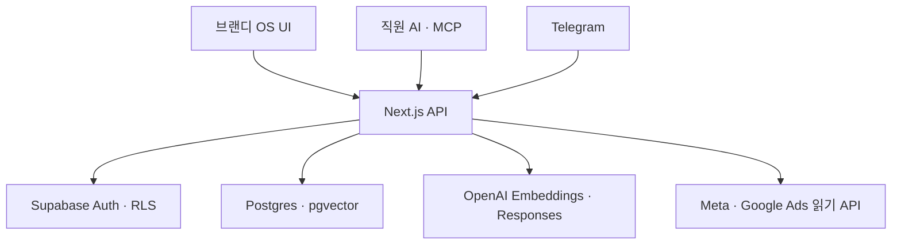

# 브랜디 OS v2 구현·인수 문서

## 1. 이번 구현 범위

업로드된 핸드오프 문서와 UI 밑그림의 3단 정보 구조(대분류 → 메뉴 → 본문)를 Next.js로 다시 구현했다. 지식의 생성·검색·정본화를 토대로 업무·목표·회의·콘텐츠·성과가 같은 운영 기록으로 연결된다.

| 영역 | 구현 상태 | 실제 동작 |
| --- | --- | --- |
| 로그인 | 구현 | 이메일·비밀번호 로그인, Supabase Auth 세션 생성·복구·로그아웃 |
| 홈 | 구현 | 주간 발행, 월 순매출(만원), 진행 영상, 운영 경고, 다음 업무 |
| 문서 작업공간 | 구현 | 정본 의식적 편집 게이트, 전 직원 자기 승격, 버전 이력·복원, 볼트 멱등 적재 |
| 검토함 | 구현 | `draft → team → canonical` 자기 승격과 선택적 검토 단계 |
| 지식 검색 | 구현 | 키워드/의미/하이브리드 검색, 문서·버전·청크 인용 |
| 직원 AI API | 구현 | 사용자 JWT 및 읽기 전용 Agent PAT 인증 |
| Telegram 창구 | 구현 | 정본 Q&A, `/요약`, `/인박스`, `#raw`, `/후기`, `/썸네일기록`, 사진 OCR |
| MCP | 구현 | 검색, 원문 읽기, 사람 JWT 기반 초안 저장 |
| 목표·의사결정 | 구현 | 월별 목표–KPI 연결, 달성률·병목 자동 집계, 근거·후속 실행 관리 |
| 프로젝트·AI 작업 | 구현 | 프로젝트별 업무, GPT·Codex·Claude 요청서, 완료 조건, 검수 상태 통합 관제 |
| 업무 | 구현 | 프로젝트·담당자·기한 연결, 칸반 드래그 상태 이동, 완료율 관리 |
| 회의 | 구현 | 준비→진행·전사→결정·실행, 전사 후 녹음 원본 폐기, 결정·미해결·담당/기한 업무 추출 및 이월 |
| Skill | 구현 | 개인/회사 범위, 시작 조건·자료·절차·결과물·품질 기준, 회사 Skill 승격 |
| 콘텐츠 | 구현 | 롱폼→권장 파생물 10개 생성, 묶음 검수, 플랫폼별 일정, 드래그 캘린더 |
| 매출·퍼널·KPI | 구현 | 브랜드 순매출 원장, 유튜브→스토어 퍼널, 주간 KPI와 외부 관리자 링크 |
| 광고 성과 | 구현 | Meta·Google 직접 API 일별 집계, 브랜드 전환, 광고비·전환 매출·ROAS·CPA, 매출·재무 광고비 교차 확인 |
| 월간 보고서 | 구현 | 목표·업무·회의·결정·콘텐츠·매출 자동 집계, Markdown 복사·다운로드 |
| 운영 모니터링 | 구현 | DB·인증·검색·Telegram·임베딩 큐·연결 상태와 보안 경계 확인, 관리자 재시도 |
| 구성원 | 구현 | 실제 Auth 계정, 9명 조직 명부, 소속·복수 역할·온보딩·민감정보 권한 관리 |
| 일정·연차 | 구현 | 회의·휴가·업무·발행·계약 주간 통합 일정, 휴가 승인과 잔여 연차 원자적 차감 |
| 경영지원 | 구현 | 국민·신한 카드 CSV, 자동 분류, VAT 준비, 계약·구독·비공개 문서 보관 |
| 감사 로그 | 구현 | 운영 기록의 생성·수정·보관 이력 자동 적재·조회 |

## 2. 실행 구조



Supabase의 기존 ERP 테이블은 변경하지 않는다. 기존 `os_*` 지식 테이블과 검색 RPC를 그대로 사용한다. `os_records`는 실행 계층, `os_record_events`는 변경 이력이며 두 테이블 모두 RLS가 활성화된다.

## 3. 운영 기록 모델

모든 실행 메뉴는 `/api/v1/records` 계약을 공유한다. 기록 유형에 따라 화면 문구와 상태 흐름만 달라지고, 공통으로 담당자·팀·브랜드·기한·진행률·목표/현재값·금액·태그·출처 링크를 가진다. 수정은 `expectedVersion`을 확인해 동시 덮어쓰기를 방지하며 삭제 대신 보관한다.

- 목표·KPI와 업무를 `parent_id`로 연결 가능
- 목표·KPI의 기준 월은 `metadata.periodMonth`로 관리하며 KPI 실적을 상위 목표에 자동 집계
- 콘텐츠의 원본/파생 산출물을 같은 계층으로 연결 가능
- 브랜드별 매출·퍼널·CRM 기록을 같은 API로 집계 가능
- 생성·수정·보관 시 이벤트가 DB 트리거로 자동 기록
- 프로젝트→업무·AI 요청, 회의→결정·후속 업무, 롱폼→파생 콘텐츠를 같은 `parent_id`로 연결
- 콘텐츠 권장 기본값은 쇼츠 3개 동시 발행, 카드뉴스 1개, 스레드 단문 3개, 짧은 포스트 2개, 연속 스레드 1개

## 4. 회의 녹음과 요약

- 브라우저 마이크로 임시 녹음한 뒤 전사가 끝나면 브라우저 메모리에서 원본을 폐기한다.
- Vercel 요청 한도를 고려해 녹음 1개는 4MB 이하, 약 15분 단위로 나눈다.
- 신규 회의는 전사 텍스트만 보존한다. 과거 private Storage 녹음은 기존 권한과 서명 URL로만 열 수 있다.
- OpenAI 키가 있으면 AI 요약을 사용하고, 없거나 실패하면 원문의 명시 문장을 이용한 로컬 보조 요약으로 저하한다.
- 결정사항과 후속 업무는 회의의 자식 운영 기록으로 생성되어 감사 이력이 남는다.
- 이전 회의의 미해결 안건, 완료 전 업무, 주간 KPI 변동을 다음 회의 준비 화면에 자동으로 모은다.
- 담당자나 기한이 원문에 없으면 추측하지 않고 빈 값으로 보존한다.

## 5. 상태와 권한

| 문서 상태 | 의미 | 기본 접근 |
| --- | --- | --- |
| `draft` | 개인 초안 | 작성자 |
| `team` | 팀 공유 | 같은 팀 |
| `review` | 검토 요청 | 검토 권한자 |
| `reviewed` | 검토 완료 | 조직 사용자 |
| `canonical` | 회사 정본 | 조직 사용자, Agent PAT, Telegram |
| `archived` | 보관 | 정책에 따른 사용자 |

- 사람 사용자는 Supabase JWT로 RLS 정책을 그대로 적용받는다.
- Agent PAT는 서버에서 SHA-256 해시만 저장하며 기본적으로 `canonical` 검색/조회만 허용한다.
- Agent PAT로 쓰기는 금지한다. MCP `save_knowledge`는 반드시 사람 계정의 `OS_USER_JWT`를 사용한다.
- 서비스 역할 키는 브라우저 번들에 포함하지 않고 Vercel 서버 환경변수로만 둔다.
- 모든 활성 직원은 자기 문서를 정본으로 직접 승격할 수 있다. 정본 편집은 UI 경고 확인 뒤에만 열리고 모든 저장은 버전으로 남는다.

## 6. 검색 처리

1. 요청 권한에 맞는 문서 상태를 교집합으로 계산한다.
2. 의미/하이브리드 모드라면 `text-embedding-3-small` 임베딩을 만든다.
3. 기존 `os_search_knowledge` RPC로 전문 검색과 벡터 유사도를 결합한다.
4. 임베딩 설정이나 RPC에 문제가 있으면 안전하게 문서 키워드 검색으로 저하한다.
5. 모든 결과에 `documentId`, `version`, `chunkId` 인용 정보를 반환한다.

새 문서와 볼트 적재 문서는 `os_embedding_jobs` 큐에 쌓인다. `/api/v1/indexing`은 관리자만 큐 현황을 보거나 제한된 배치를 실행·재시도할 수 있다. Vercel 예약 작업은 매일 03:00 KST에 최대 100건을 처리하고, 같은 실행에서 최근 7일 Meta·Google 광고 지표도 다시 수집해 지연 전환을 보정한다. 동일 문서 작업은 `pending → running` 상태 선점에 성공한 실행자만 처리한다. 15분 넘게 멈춘 실행은 자동 복구되고 이전 버전 작업은 실패 이력으로 닫힌다. 새 청크 저장에 실패하면 기존 검색 청크를 복원하므로 이미 검색되던 지식은 계속 유지된다.

## 7. 광고 성과 수집

- `/performance/ads`는 광고 운영 화면이 아니라 집계 화면이다. 소재·타깃·입찰 변경은 Meta/Google에서만 한다.
- Meta Marketing API `v26.0`의 account insights와 Google Ads API `v25`의 `searchStream`을 읽기 전용으로 호출한다. 버전은 환경변수로 올릴 수 있다.
- 일별 `광고비·귀속 매출·전환·노출·클릭`을 `(provider, brand, date)` 기준으로 멱등 upsert한다.
- 관리자 수동 동기화와 매일 03:00 KST 자동 동기화를 제공하며, 비관리자는 집계 결과만 읽는다.
- API 토큰·OAuth 비밀값은 Vercel 서버 환경변수에만 있고 DB·브라우저 응답·로그에는 저장하지 않는다.
- OS 매출 원장과 비교하며, 경영지원 권한이 있는 사용자에게만 재무 광고비 교차값을 보여준다.

## 8. 배포 환경변수

### 콘텐츠 스튜디오

- 콘텐츠 메뉴는 `주제 → 원고 → 제목·썸네일 → 숏폼 → 발행 → 유튜브 관리 → 성과`의 7페이지 흐름이다.
- 생성 API는 실행 시점에 회사 절차 정본을 읽고 Claude 초안과 자가검수 2패스를 거친다.
- 파생 콘텐츠는 `검토 → 발행 준비 → 최종 승인·예약 → 발행` 순서를 건너뛸 수 없다.
- 쇼츠는 구간 제안과 ffmpeg 제작 작업을 분리한다. 사람에게 채택된 구간만 외부 워커 대기열에 들어간다.
- Vercel은 생성·상태·작업 기록을 담당하며, 대용량 영상의 전사·ffmpeg 렌더는 별도 워커가 담당한다.
- Claude 키가 없으면 결과를 가짜로 만들지 않고 `ai_job` 연결 대기로 저장한다.

Vercel 프로젝트 Production/Preview에 다음 값을 설정한다.

```dotenv
NEXT_PUBLIC_SUPABASE_URL=https://evnbriltxiqgglnftlrw.supabase.co
NEXT_PUBLIC_SUPABASE_PUBLISHABLE_KEY=...
SUPABASE_SERVICE_ROLE_KEY=...
OPENAI_API_KEY=...
OPENAI_EMBEDDING_MODEL=text-embedding-3-small
OPENAI_ANSWER_MODEL=gpt-5.6-luna
OPENAI_TRANSCRIPTION_MODEL=gpt-4o-mini-transcribe
OPENAI_VISION_MODEL=gpt-5.6-luna
ANTHROPIC_API_KEY=...
CLAUDE_HAIKU_MODEL=claude-haiku-4-5-20251001
CLAUDE_SONNET_MODEL=claude-sonnet-4-5-20250929
YOUTUBE_API_KEY=...
YOUTUBE_CLIENT_ID=...
YOUTUBE_CLIENT_SECRET=...
YOUTUBE_TOKEN_ENCRYPTION_KEY=32바이트_이상_무작위_비밀값
YOUTUBE_OAUTH_REDIRECT_URI=https://brandyaction-os.vercel.app/api/v1/youtube/oauth/callback
CRON_SECRET=충분히_긴_무작위_값
NEXT_PUBLIC_DEMO_MODE=false
```

Telegram을 연결할 때만 아래 값을 추가한다.

```dotenv
TELEGRAM_BOT_TOKEN=...
TELEGRAM_WEBHOOK_SECRET=...
OS_PUBLIC_URL=https://brandyaction-os.vercel.app
TELEGRAM_ALLOWED_USER_IDS=123,456
TELEGRAM_BOT_USERNAME=your_bot
TELEGRAM_CAPTURE_OWNER_EMAIL=wjdgh1346@gmail.com
```

광고 계정 연결 시 다음 서버 전용 값을 추가한다.

```dotenv
META_ADS_API_VERSION=v26.0
META_ADS_ACCESS_TOKEN=...
META_ADS_MYIN_ACCOUNT_ID=...
META_ADS_BRANDYEDU_ACCOUNT_ID=...
GOOGLE_ADS_API_VERSION=v25
GOOGLE_ADS_DEVELOPER_TOKEN=...
GOOGLE_ADS_CLIENT_ID=...
GOOGLE_ADS_CLIENT_SECRET=...
GOOGLE_ADS_REFRESH_TOKEN=...
GOOGLE_ADS_LOGIN_CUSTOMER_ID=...
GOOGLE_ADS_MYIN_CUSTOMER_ID=...
GOOGLE_ADS_BRANDYEDU_CUSTOMER_ID=...
```

## 9. 적용 순서

1. `202608290001_os_integrations.sql`부터 `202608300007_youtube_oauth.sql`까지 번호순으로 적용한다.
2. Vercel 환경변수를 등록한다.
3. GitHub `main`을 배포하고 `/api/v1/health`에서 `database=ready`, `auth=ready`를 확인한다.
4. 첫 관리자를 Supabase Auth에 만들고 같은 UUID로 `os_profiles`의 `role=admin`, `is_active=true`를 확인한다.
5. OS 설정에서 Agent PAT를 발급하고, 필요할 때 MCP의 `AGENT_PAT`에 주입한다.
6. Telegram 환경변수가 준비된 운영 배포는 `/api/v1/telegram/webhook`과 비밀 토큰을 Bot API에 자동 등록한다. 미등록 사용자는 요청 상태로 저장되며 `설정 → 운영 모니터링 → Telegram 웹훅`에서 승인·거절한다. `TELEGRAM_ALLOWED_USER_IDS`는 기존 사용자용 선택적 비상 허용 목록이다.
7. 볼트는 `npm run import:knowledge -- --root <경로> --dry-run` 확인 후 `--apply`한다. `02_Wiki`·`00_Skills`만 정본이며 재실행해도 기존 상태를 덮어쓰지 않는다.
8. Google Cloud OAuth 웹 클라이언트의 승인된 리디렉션 URI에 `https://brandyaction-os.vercel.app/api/v1/youtube/oauth/callback`을 정확히 등록한다. 이후 `콘텐츠 → 유튜브 관리`에서 관리자 계정으로 채널 동의를 완료한다.

## 10. 외부 확인이 있어야 남는 연결

- OpenAI API 키와 예약 작업 보안값 등록 후 의미 검색·답변 생성 및 기존 문서 재색인 실행
- Telegram Bot Token·웹훅 보안값·허용 사용자 등록 후 운영 모니터링에서 연결 실행
- Meta/Google 광고 계정의 읽기 권한 토큰·고객 ID 등록 후 관리자 첫 동기화 실행
- Drive/Slack/Notion 등 외부 수집기는 계정 연결과 수집 범위 승인 후 개발

외부 연결 전에도 내부 기록·상태·권한·성과 입력은 운영 가능하다.
