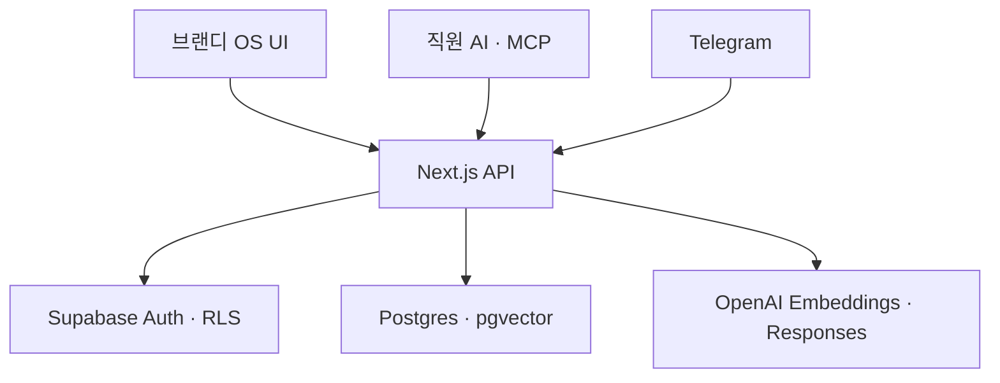

# 브랜디 OS v2 구현·인수 문서

## 1. 이번 구현 범위

업로드된 핸드오프 문서와 UI 밑그림의 3단 정보 구조(대분류 → 메뉴 → 본문)를 Next.js로 다시 구현했다. 지식의 생성·검색·정본화를 토대로 업무·목표·회의·콘텐츠·성과가 같은 운영 기록으로 연결된다.

| 영역 | 구현 상태 | 실제 동작 |
| --- | --- | --- |
| 로그인 | 구현 | Supabase Auth 세션 생성·복구·로그아웃 |
| 홈 | 구현 | 진행 업무, 7일 내 기한, 목표, 결정 대기 요약 |
| 문서 작업공간 | 구현 | 목록, 필터, 신규 작성, 편집, 낙관적 버전 충돌 방지 |
| 검토함 | 구현 | `draft → team → review → reviewed → canonical` 상태 전환 |
| 지식 검색 | 구현 | 키워드/의미/하이브리드 검색, 문서·버전·청크 인용 |
| 직원 AI API | 구현 | 사용자 JWT 및 읽기 전용 Agent PAT 인증 |
| Telegram 창구 | 구현 | 웹훅 검증, 사용자 제한, 정본 검색, 근거 기반 답변 |
| MCP | 구현 | 검색, 원문 읽기, 사람 JWT 기반 초안 저장 |
| 목표·의사결정 | 구현 | 목표/현재값, 진행률, 상태, 근거·후속 실행 관리 |
| 업무·회의·AI 작업 | 구현 | 담당 팀, 기한, 우선순위, 진행률, 결과 링크 관리 |
| 콘텐츠 | 구현 | 주제→원고→패키지→숏폼→발행→캘린더→성과 기록 |
| 매출·퍼널·CRM | 구현 | 브랜드별 금액, 전환 목표/실적, 고객·CRM 액션 관리 |
| 구성원 | 구현 | 실제 Auth 계정의 역할·팀·사용 상태 관리 |
| 감사 로그 | 구현 | 운영 기록의 생성·수정·보관 이력 자동 적재·조회 |

## 2. 실행 구조



Supabase의 기존 ERP 테이블은 변경하지 않는다. 기존 `os_*` 지식 테이블과 검색 RPC를 그대로 사용한다. `os_records`는 실행 계층, `os_record_events`는 변경 이력이며 두 테이블 모두 RLS가 활성화된다.

## 3. 운영 기록 모델

모든 실행 메뉴는 `/api/v1/records` 계약을 공유한다. 기록 유형에 따라 화면 문구와 상태 흐름만 달라지고, 공통으로 담당자·팀·브랜드·기한·진행률·목표/현재값·금액·태그·출처 링크를 가진다. 수정은 `expectedVersion`을 확인해 동시 덮어쓰기를 방지하며 삭제 대신 보관한다.

- 목표·KPI와 업무를 `parent_id`로 연결 가능
- 콘텐츠의 원본/파생 산출물을 같은 계층으로 연결 가능
- 브랜드별 매출·퍼널·CRM 기록을 같은 API로 집계 가능
- 생성·수정·보관 시 이벤트가 DB 트리거로 자동 기록

## 4. 상태와 권한

| 문서 상태 | 의미 | 기본 접근 |
| --- | --- | --- |
| `draft` | 개인 초안 | 작성자 |
| `team` | 팀 공유 | 같은 팀 |
| `review` | 검토 요청 | 검토 권한자 |
| `reviewed` | 검토 완료 | 조직 사용자 |
| `canonical` | 회사 정본 | 조직 사용자, Agent PAT, Telegram |
| `archived` | 보관 | 정책에 따른 사용자 |

- 사람 사용자는 Supabase JWT로 RLS 정책을 그대로 적용받는다.
- Agent PAT는 서버에서 SHA-256 해시만 저장하며 기본적으로 `canonical` 검색/조회만 허용한다.
- Agent PAT로 쓰기는 금지한다. MCP `save_knowledge`는 반드시 사람 계정의 `OS_USER_JWT`를 사용한다.
- 서비스 역할 키는 브라우저 번들에 포함하지 않고 Vercel 서버 환경변수로만 둔다.

## 5. 검색 처리

1. 요청 권한에 맞는 문서 상태를 교집합으로 계산한다.
2. 의미/하이브리드 모드라면 `text-embedding-3-small` 임베딩을 만든다.
3. 기존 `os_search_knowledge` RPC로 전문 검색과 벡터 유사도를 결합한다.
4. 임베딩 설정이나 RPC에 문제가 있으면 안전하게 문서 키워드 검색으로 저하한다.
5. 모든 결과에 `documentId`, `version`, `chunkId` 인용 정보를 반환한다.

## 6. 배포 환경변수

Vercel 프로젝트 Production/Preview에 다음 값을 설정한다.

```dotenv
NEXT_PUBLIC_SUPABASE_URL=https://evnbriltxiqgglnftlrw.supabase.co
NEXT_PUBLIC_SUPABASE_PUBLISHABLE_KEY=...
SUPABASE_SERVICE_ROLE_KEY=...
OPENAI_API_KEY=...
OPENAI_EMBEDDING_MODEL=text-embedding-3-small
OPENAI_ANSWER_MODEL=gpt-5.6-luna
NEXT_PUBLIC_DEMO_MODE=false
```

Telegram을 연결할 때만 아래 값을 추가한다.

```dotenv
TELEGRAM_BOT_TOKEN=...
TELEGRAM_WEBHOOK_SECRET=...
TELEGRAM_ALLOWED_USER_IDS=123,456
TELEGRAM_BOT_USERNAME=your_bot
```

## 7. 적용 순서

1. `202608290001_os_integrations.sql`, `202608290002_operating_core.sql` 순서로 적용한다.
2. Vercel 환경변수를 등록한다.
3. GitHub `main`을 배포하고 `/api/v1/health`에서 `database=ready`, `auth=ready`를 확인한다.
4. 첫 관리자를 Supabase Auth에 만들고 같은 UUID로 `os_profiles`의 `role=admin`, `is_active=true`를 확인한다.
5. OS 설정에서 Agent PAT를 발급하고, 필요할 때 MCP의 `AGENT_PAT`에 주입한다.
6. Telegram 사용 시 웹훅 URL을 `/api/v1/telegram/webhook`으로 등록한다.

## 8. 외부 확인이 있어야 남는 연결

- 새 로그인 메일 링크의 실제 브라우저 로그인 확인
- OpenAI API 키 등록 후 의미 검색·답변 생성 및 기존 문서 재색인
- Telegram Bot Token·허용 사용자 확인 후 웹훅 연결
- Drive/Slack/Notion 등 외부 수집기는 계정 연결과 수집 범위 승인 후 개발

외부 연결 전에도 내부 기록·상태·권한·성과 입력은 운영 가능하다.
